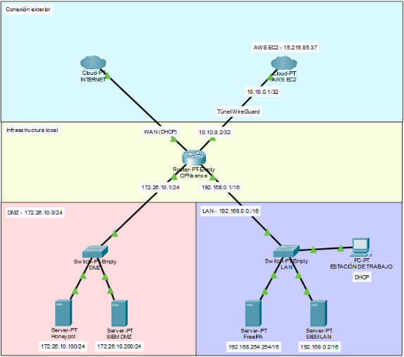
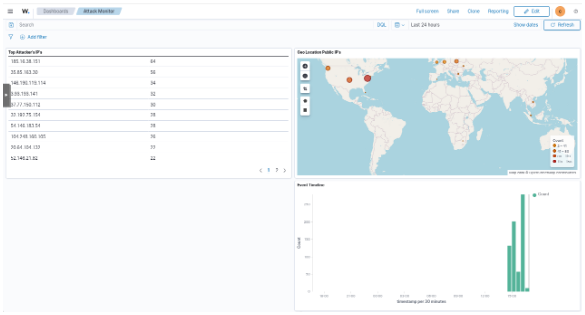

# 🛡️ Cyber Defense S.L. – Honeypot & Centralized Monitoring Infrastructure

> **Diseño e implementación de una infraestructura de ciberseguridad con honeypot y monitorización centralizada**  
> *Trabajo Final de Ciclo – IES Europa – Administración de Sistemas Informáticos en Red*

---

## 📌 Descripción

Este proyecto despliega una **infraestructura completa de ciberseguridad** basada en software libre, compuesta por:

- 🔍 **Honeypot** (Trapster) que simula servicios reales (SSH, HTTP, FTP, RDP, etc.) para atraer y registrar ataques.
- 📊 **SIEM** (Wazuh) en dos zonas (DMZ y LAN) para centralizar logs, generar alertas MITRE ATT&CK y visualizar amenazas en tiempo real.
- 🔐 **Firewall/Router** OPNsense con segmentación de red (WAN, DMZ, LAN) y reglas estrictas que aíslan la DMZ de la LAN.
- 🌐 **Túnel WireGuard** entre una instancia **EC2 de AWS** y OPNsense para exponer el honeypot a Internet sin abrir puertos en la red local.
- 👥 **Autenticación centralizada** con FreeIPA en la LAN, integrando una estación de trabajo Linux Mint en el dominio.
- 📈 **Dashboard personalizado** en Wazuh con tabla de IPs atacantes, mapa de coordenadas y evolución temporal de los ataques.

El proyecto demuestra que **con herramientas open source y una planificación adecuada se puede construir un SOC profesional de bajo coste**, capaz de detectar amenazas reales y proporcionar inteligencia de adversarios.

---

## 🏗️ Arquitectura

  

| Zona | Componentes | Función |
|------|-------------|---------|
| **WAN** | Internet → AWS EC2 (WireGuard) | Puerta de entrada pública. El atacante se conecta a la IP elástica de EC2. |
| **DMZ** | OPNsense (firewall), Honeypot (Trapster), Wazuh DMZ | Trampa que registra ataques. Aislada de la LAN por reglas de firewall. |
| **LAN** | FreeIPA, Wazuh LAN, Workstation (Linux Mint) | Red interna de la organización, monitorizada y con autenticación centralizada. |

**Flujo del ataque:**  
Internet → EC2 (WireGuard) → OPNsense → DMZ (honeypot)  
*El firewall bloquea cualquier intento de la DMZ hacia la LAN.*

**Flujo de logs:**  
Honeypot → agente Wazuh → Wazuh DMZ → dashboard / alertas  
EC2 (iptables) → agente Wazuh (a través del túnel) → Wazuh DMZ

---

## 🧰 Tecnologías utilizadas

| Tecnología | Versión | Propósito |
|------------|---------|------------|
| **Proxmox VE** | 9.1 | Hipervisor para todas las máquinas virtuales |
| **OPNsense** | 26.1 | Firewall, router y VPN (WireGuard) |
| **Wazuh** | 4.14 | SIEM (manager, indexer, dashboard) |
| **Trapster** | 1.1.8 | Honeypot ligero (Docker) |
| **WireGuard** | 1.0+ | Túnel VPN entre EC2 y OPNsense |
| **FreeIPA** | 4.13 | Gestión centralizada de identidades (LDAP, Kerberos) |
| **Rocky Linux** | 9.7 | Sistema base para FreeIPA |
| **Linux Mint** | 22.2 | Estación de trabajo integrada en el dominio |
| **Debian** | 13.3 | Sistemas base para honeypot y Wazuh |
| **AWS EC2** | t3.large | Instancia en la nube con IP elástica |

---

## 🚀 Instalación y configuración (resumen)

La documentación completa se encuentra en la [memoria del proyecto](<ASIR_25-26 - Honeypot y Monitorización - Victor Rae.pdf>). A continuación se indican los pasos clave:

### 1. Virtualización con Proxmox
- Crear bridges: `vmbr0` (WAN), `vmbr1` (LAN), `vmbr2` (DMZ).
- Crear las VMs: OPNsense, honeypot (Debian), Wazuh DMZ, FreeIPA (Rocky), Wazuh LAN, Workstation (Linux Mint).

### 2. Configurar OPNsense
- Interfaces: LAN (192.168.0.1/16), DMZ (172.26.10.1/24), WAN (DHCP).
- Reglas DMZ: bloquear tráfico hacia LAN, permitir todo lo demás.
- WireGuard: instancia `AWS-EC2` (IP túnel 10.10.0.2/24, puerto 65534) y peer con EC2.
- Regla en interfaz WG: permitir tráfico solo hacia DMZ.
- Reservas DHCP: Wazuh LAN (192.168.0.2), FreeIPA (192.168.254.254).

### 3. Desplegar honeypot (Trapster)
- Instalar Docker y Docker Compose.
- Clonar repositorio de Trapster.
- Modificar `logger.py` para timestamp ISO 8601 (formato `2026-05-28T10:30:45.123+0000`).
- Modificar `docker-compose.yml` para montar volúmenes de logs y datos web.
- Personalizar la web del puerto 8080.
- Ejecutar `docker-compose up -d`.

### 4. Instalar Wazuh DMZ
- Instalar Wazuh all-in-one en Debian (IP 172.26.10.200).
- Registrar agentes: honeypot y EC2.
- Añadir `localfile` en el agente honeypot para leer `/home/cyberad/trapster-community/logs/trapster.log`.
- Crear reglas personalizadas (`local_rules.xml`) para los servicios del honeypot y para los logs de iptables de EC2.
- Configurar dashboard "Attack Monitor".

### 5. Configurar FreeIPA y Wazuh LAN
- Instalar FreeIPA en Rocky Linux (dominio `cyberdefense.local`).
- Integrar estación de trabajo Linux Mint con `freeipa-client`.
- Instalar Wazuh LAN (IP 192.168.0.2) y desplegar agentes en FreeIPA y Workstation.

### 6. Exposición exterior (AWS EC2 + WireGuard)
- Lanzar instancia EC2 t3.large en región `eu-south-2` (España).
- Asignar IP elástica.
- Instalar WireGuard, generar claves y configurar `wg0.conf` (IP túnel 10.10.0.1/24, puerto 65534, peer OPNsense).
- Habilitar `net.ipv4.ip_forward` y aplicar reglas de iptables (tabla `raw`) para registrar el tráfico TCP hacia los puertos del honeypot.
- Instalar agente Wazuh en EC2 y añadir `localfile` para `/var/log/kern.log`.

---

## 📈 Resultados

- **Más de 100 intentos de conexión** desde IPs únicas durante el período de exposición.
- **60% de los ataques** dirigidos a los puertos **2222 (SSH)** y **8080 (HTTP)**.
- La mayoría de IPs provenían de **proveedores de hosting** (DigitalOcean, OVH, Storm Industries), confirmando el uso de infraestructura cloud de bajo coste por parte de atacantes.
- Las **alertas de Wazuh** (reglas 140010, 140015, 140030) detectaron escaneos activos y fuerzas brutas, elevando el nivel de 6 a 12 según la insistencia.
- **Dashboard personalizado** con tabla de IPs atacantes, mapa de coordenadas y evolución temporal de los ataques.

  

---

## 🧪 Próximas mejoras (líneas futuras)

- 🔐 **Identidad híbrida** – Extender FreeIPA con confianza a Active Directory on‑premise y sincronización con Azure AD/Entra ID, añadiendo autenticación multifactor.
- 🧠 **SOC completo** – Integrar Wazuh con MISP (inteligencia de amenazas), EDR en los endpoints y un orquestador SOAR para automatizar playbooks (bloqueo de IPs, aislamiento, tickets).
- 📊 **Gobierno del riesgo** – Implementar un sistema de gestión de riesgos y cumplimiento normativo (ISO 27001, ENS, GDPR) alimentado por los hallazgos de Wazuh, con backups periódicos y recuperación ante desastres.
- ☁️ **Extensión multicloud** – Desplegar sensores ligeros en otras sedes físicas y nubes (AWS, Azure) para enviar telemetría al Wazuh central.
- 🧪 **Sandbox + Cowrie** – Añadir un entorno aislado (Cuckoo/CAPE) y un honeypot SSH mejorado (Cowrie) para analizar la post‑explotación y las herramientas utilizadas por atacantes una vez que creen haber comprometido el sistema.

---

## 📜 Licencia

Este proyecto se distribuye bajo una **Licencia Creative Commons Atribución 4.0 Internacional (CC BY 4.0)**.  
Puedes compartir y adaptar el material para cualquier propósito, siempre que reconozcas la autoría.

---

## 👤 Autor

**Víctor Rae**  
Tutor: Davinia M.  
Ciclo Formativo de Grado Superior – Administración de Sistemas Informáticos en Red  
IES Europa, curso 2025/2026
